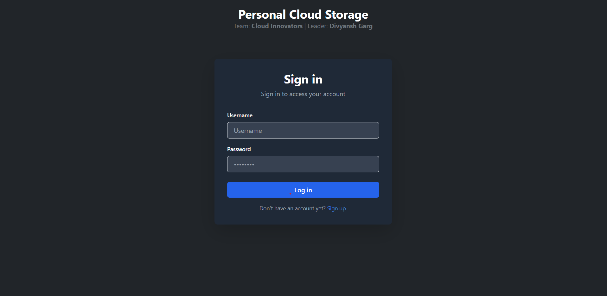
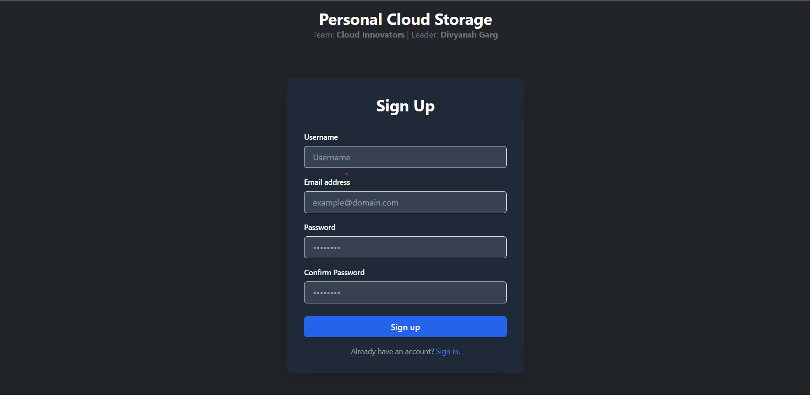
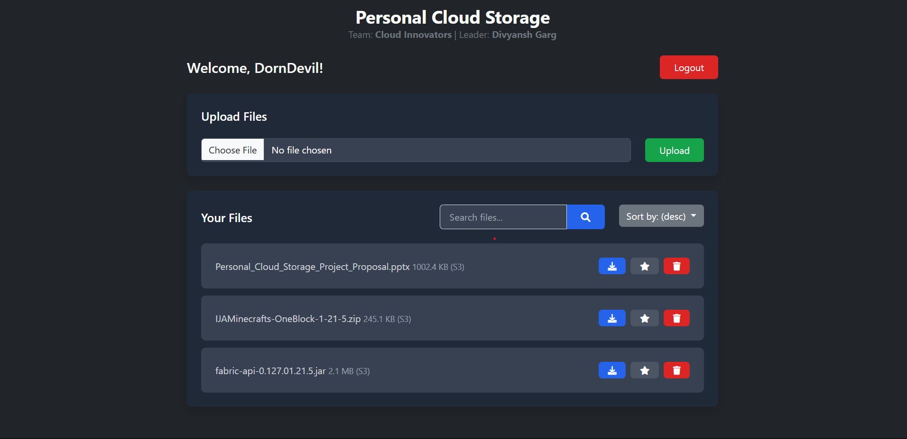

# ☁️ Cloud Storage

Welcome to **Cloud Storage**, a simple and secure web-based storage solution that allows users to upload, view, and manage their files. This project demonstrates the basics of cloud storage functionality using **Flask**, **Python**, and **Bootstrap** for the frontend.

---

## 🚀 Features

- 🌟 Upload files of various types (images, documents, etc.)
- 📂 View a list of uploaded files
- 🗑️ Delete files securely
- 🛡️ Basic validations for file type and size
- 🖥️ Responsive design using Bootstrap

---

## 🛠️ Tech Stack

| Technology | Description                          |
| ---------- | ------------------------------------ |
| Python     | Core backend logic                   |
| Flask      | Lightweight web framework            |
| Bootstrap  | Frontend framework for responsive UI |
| HTML/CSS   | Structure and styling                |
| JavaScript | Basic interactivity                  |

---

## 📸 Screenshots

<div align="center">
    
    
    
</div>

---

## ⚙️ Installation

1️⃣ Clone this repository:

```bash
git clone https://github.com/Divyansh3105/Cloud-Storage.git
```

2️⃣ Navigate into the project folder:

```bash
cd Cloud-Storage
```

3️⃣ Install the required packages:

```bash
pip install -r requirements.txt
```

4️⃣ Run the Flask app:

```bash
python app.py
```

---

## 🌐 Usage

- Open your browser and go to `http://127.0.0.1:5000/`
- Upload, view, or delete files from the interface.

---

## 🤝 Contribution

Pull requests are welcome! Feel free to fork the repository and submit improvements.

---

## 📜 License

This project is licensed under the **MIT License**.

---

## 🔗 Links

- [🔗 GitHub Repo](https://github.com/Divyansh3105/Cloud-Storage)

## Contact

- 📧 Email: divyanshgarg3105@gmail.com
- 🌐 GitHub: [@Divyansh3105](https://github.com/Divyansh3105)
